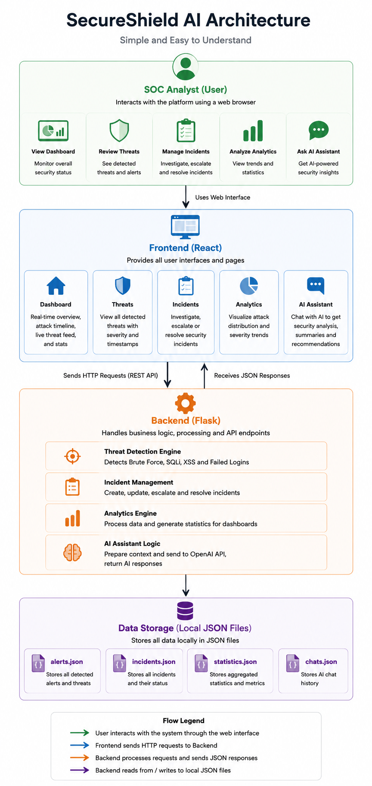
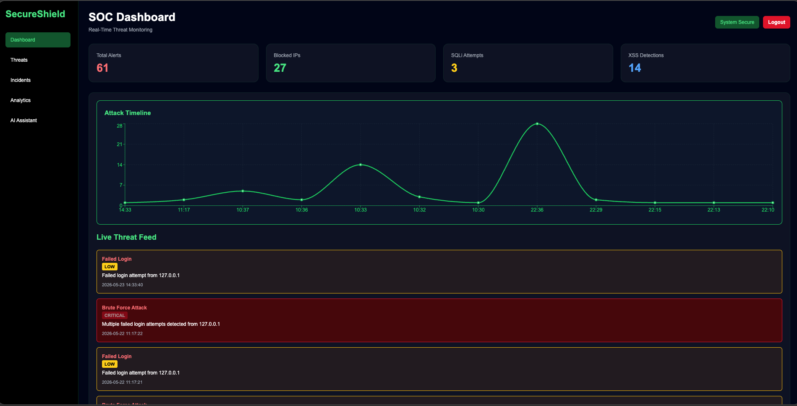
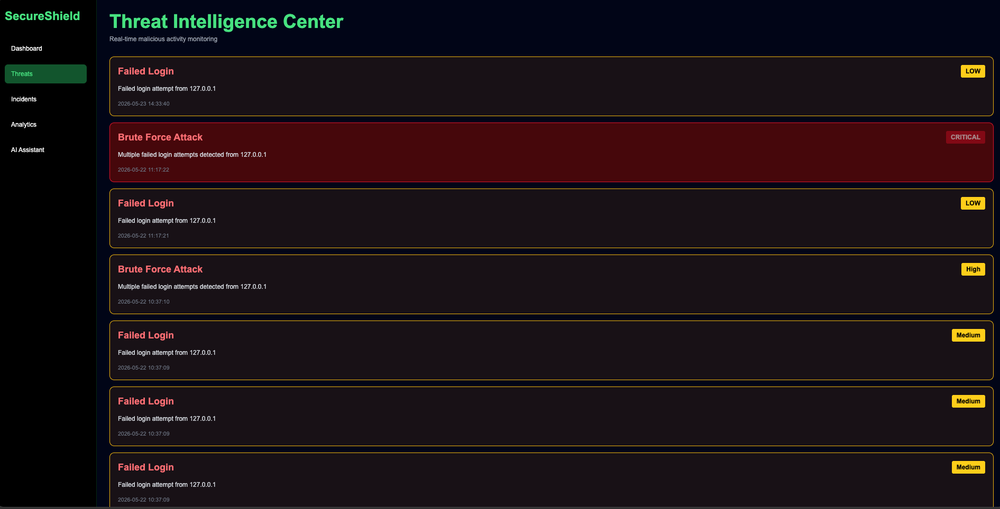
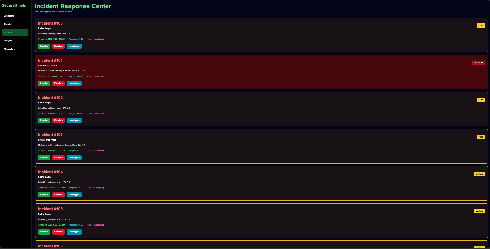
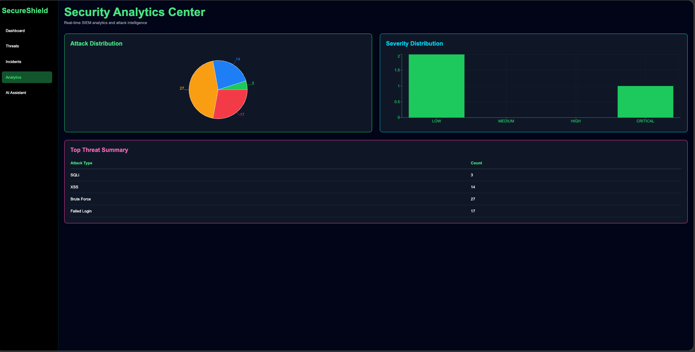
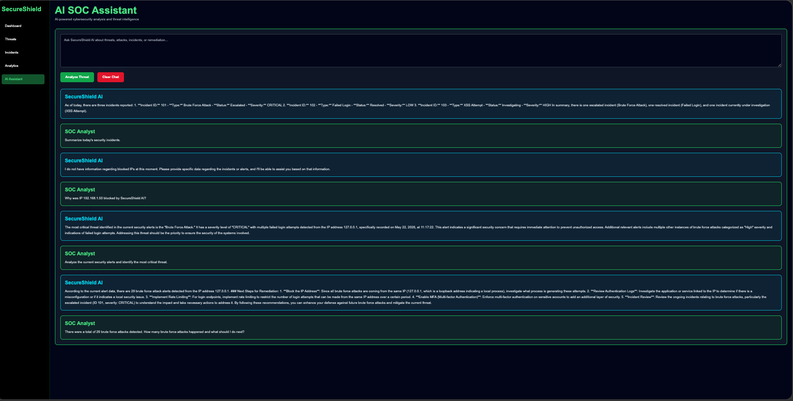

# 🛡️ SecureShield AI

AI-Powered Security Operations Center (SOC) Platform for Threat Detection, Incident Response, Security Analytics, and AI-Assisted Investigations.

SecureShield AI is a full-stack cybersecurity platform that simulates a real-world Security Operations Center (SOC) environment. The platform enables analysts to monitor threats, investigate incidents, analyze attack trends, and receive AI-powered security recommendations.

---

## 🏗️ Architecture Diagram



The SecureShield AI architecture follows a simple layered design that separates the user interface, application logic, and data storage components.

### Architecture Flow

```text
SOC Analyst
	│
	▼
React Frontend
	│
	▼
Flask Backend
	│
	▼
Local JSON Data Storage
```

### Components

### 👨‍💻 SOC Analyst

The SOC Analyst interacts with the platform through the web interface and can:

- Monitor security alerts
- Review detected threats
- Investigate incidents
- Analyze attack trends
- Interact with the AI SOC Assistant

---

### 🎨 React Frontend

The frontend provides all user-facing pages:

- Dashboard
- Threats
- Incidents
- Analytics
- AI Assistant

The frontend sends API requests to the Flask backend and displays security data to the analyst.

---

### ⚙️ Flask Backend

The backend handles all business logic and security processing.

#### Core Modules

**Threat Detection Engine**
- Detects Brute Force attacks
- Detects SQL Injection attacks
- Detects XSS attacks
- Detects Failed Login attempts

**Incident Management**
- Creates incidents
- Updates incident status
- Escalates incidents
- Resolves incidents

**Analytics Engine**
- Generates security statistics
- Produces attack distribution data
- Produces severity distribution data

**AI Assistant Logic**
- Processes analyst questions
- Analyzes SecureShield AI data
- Generates cybersecurity-focused responses

---

### 📁 Local Data Storage

SecureShield AI stores data locally using JSON files.

Examples include:

- alerts.json
- incidents.json
- statistics.json
- chats.json

These files store detected threats, incident information, analytics data, and AI assistant chat history.

---

### Data Flow

1. The SOC Analyst interacts with the React frontend.
2. The frontend sends API requests to the Flask backend.
3. The backend processes threat, incident, analytics, or AI requests.
4. The backend reads or updates local JSON files.
5. The backend returns JSON responses to the frontend.
6. The frontend displays updated information to the analyst.

This architecture keeps SecureShield AI lightweight, easy to understand, and easy to deploy while still simulating a real-world Security Operations Center (SOC) workflow.

---

## 🎥 Demo Video

🔗 Demo Link: [Watch SecureShield AI Demo](https://drive.google.com/file/d/1dd36FDTcOz0Mx4J0RoM4l4h0s47P7h9u/view?usp=sharing)

This video demonstrates:

- Dashboard
- Threat Monitoring
- Incident Response
- Security Analytics
- AI SOC Assistant
- Threat Detection Workflow

---

# 🚀 Key Features

## Threat Detection Engine

Automatically detects:

* Brute Force Attacks
* Failed Login Attempts
* SQL Injection Attempts
* Cross-Site Scripting (XSS)

---

## Incident Management

Supports:

* Investigation
* Escalation
* Resolution
* Severity Tracking
* Analyst Assignment

---

## Security Analytics

Provides:

* Attack Distribution
* Severity Distribution
* Threat Summaries
* Historical Analysis

---

## AI Security Intelligence

Provides:

* Incident Summaries
* Threat Analysis
* Security Recommendations
* Remediation Guidance
* Security Reporting

---

# 📸 Screenshots

## SOC Dashboard



The SOC Dashboard provides a real-time overview of the organization's security posture.

### Features

* Total Alerts Counter
* Blocked IP Counter
* SQL Injection Detection Counter
* XSS Detection Counter
* Real-Time Attack Timeline
* Live Threat Feed
* Security Status Indicator
* Analyst Logout Functionality

### Purpose

The dashboard acts as the central monitoring location for SOC analysts, allowing them to quickly identify attack spikes, active threats, and overall security health.

---

## Threat Intelligence Center



The Threat Intelligence Center displays all detected threats and malicious activities.

### Features

* Real-Time Threat Feed
* Threat Classification
* Severity Assignment
* Threat History
* Detection Timestamps

### Supported Threat Types

* Brute Force Attacks
* Failed Login Attempts
* SQL Injection Attempts
* Cross-Site Scripting (XSS)

### Severity Levels

* LOW
* MEDIUM
* HIGH
* CRITICAL

### Purpose

Allows SOC analysts to monitor malicious activities and prioritize investigations based on severity.

---

## Incident Response Center



The Incident Response Center is used to investigate and manage security incidents.

### Features

* Incident Tracking
* Incident Severity Classification
* Incident Assignment
* Investigation Workflow
* Escalation Workflow
* Resolution Workflow

### Incident Information

Each incident contains:

* Incident ID
* Attack Type
* Description
* Timestamp
* Assigned Analyst
* Status
* Severity

### Available Actions

#### Resolve

Marks an incident as resolved.

#### Escalate

Escalates an incident for higher-priority investigation.

#### Investigate

Begins active incident analysis.

### Purpose

Provides a realistic incident response workflow similar to what SOC analysts use in enterprise environments.

---

## Security Analytics Center



The Security Analytics Center provides statistical and visual analysis of detected attacks.

### Features

#### Attack Distribution Chart

Displays the number of attacks by category.

Examples:

* SQL Injection
* XSS
* Brute Force
* Failed Login

#### Severity Distribution Chart

Displays attack counts grouped by severity.

Examples:

* LOW
* MEDIUM
* HIGH
* CRITICAL

#### Threat Summary Table

Provides a detailed breakdown of attack counts.

### Purpose

Helps analysts identify attack patterns, trends, and the most common threats affecting the environment.

---

## AI SOC Assistant



The AI SOC Assistant is a cybersecurity-focused chatbot designed specifically for SecureShield AI.

Unlike a general-purpose chatbot, the AI Assistant only answers questions related to SecureShield AI threat data, incident data, and SOC operations.

### Supported Questions

#### Threat Analysis

Examples:

* How many brute force attacks occurred?
* How many XSS attacks were detected?
* What is the most common attack?
* Which attack is most dangerous?

#### Incident Analysis

Examples:

* Which incidents are escalated?
* Which incidents are resolved?
* Which incidents are under investigation?
* Which incident has the highest severity?

#### Security Reporting

Examples:

* Summarize today's incidents.
* Analyze the current security alerts.
* Identify the most critical threat.
* Provide a threat overview.

#### Remediation Recommendations

Examples:

* How should brute force attacks be mitigated?
* What should I do after an XSS attack?
* Recommend security improvements.
* Provide incident response guidance.

### Features

* Persistent Chat History
* Clear Chat Functionality
* SOC-Focused Responses
* Threat Intelligence Summaries
* Incident Reporting Assistance
* Remediation Guidance

### Purpose

Provides security analysts with an AI-powered assistant capable of analyzing SecureShield AI data and providing actionable security insights.

---

# 🏗️ Technologies Used

## Frontend

* React
* Vite
* JavaScript
* CSS

## Backend

* Python
* Flask

## AI

* OpenAI API

## Data

* JSON-Based Alert Storage
* Simulated SOC Data

---

# 📁 Project Structure

```text
SecureShieldAI/
│
├── backend/
│   ├── app.py
│   ├── alerts.json
│   └── requirements.txt
│
├── frontend/
│   ├── src/
│   ├── public/
│   └── package.json
│
├── docs/
│   ├── Dashboard.png
│   ├── Threats.png
│   ├── Incidents.png
│   ├── Analytics.png
│   └── Assistant.png
│
├── logs/
│
├── scripts/
│
├── .gitignore
│
└── README.md
```

---

# ⚙️ Installation

## Backend

```bash
cd backend
pip install -r requirements.txt
python app.py
```

Backend runs on:

```text
http://localhost:5000
```

---

## Frontend

```bash
cd frontend
npm install
npm run dev
```

Frontend runs on:

```text
http://localhost:5173
```

---

# 🔐 Security Features

* Brute Force Detection
* SQL Injection Detection
* XSS Detection
* Failed Login Monitoring
* Threat Severity Classification
* Incident Tracking
* AI Security Analysis
* Security Analytics Dashboard

---

# 🎯 Future Enhancements

* Real-Time Log Ingestion
* SIEM Integration
* Threat Intelligence Feeds
* Email Alerting
* PDF Security Reports
* Multi-User Authentication
* Cloud Deployment
* Role-Based Access Control (RBAC)
* Security Compliance Reporting
* Advanced Threat Hunting

---

# 👨‍💻 Author

**Ayush Velhal**

University of Texas at Dallas

Computer Science Student

Focused on:

* Cybersecurity
* Cloud Computing
* Artificial Intelligence
* Security Operations (SOC)

---

## ⭐ Project Goal

SecureShield AI was built to simulate a modern Security Operations Center (SOC) platform by combining threat detection, incident response, security analytics, and AI-powered security assistance into a single cybersecurity dashboard.
